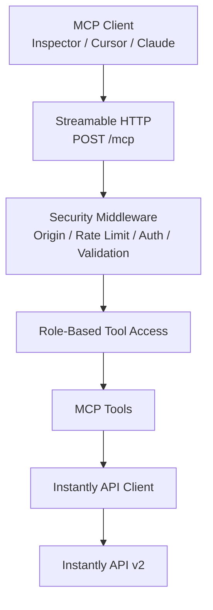

# Instantly.ai MCP Server

A secure, role-based [Model Context Protocol (MCP)] server for the Instantly.ai API v2.

Built with **Node.js, TypeScript, Express, Zod, Pino, and the official MCP SDK**.

> **Goal:** expose a focused set of Instantly operations to MCP clients while keeping write actions behind explicit roles and guardrails.

##  Live Server

**MCP endpoint**

`https://nstantly-mcp-server.onrender.com/mcp`

**Health check**

`https://nstantly-mcp-server.onrender.com/health`

The server is deployed as a **Render Web Service** and uses Streamable HTTP.

Authentication is required for `/mcp`:

```text
Authorization: Bearer <YOUR_ROLE_TOKEN>
```

No Instantly API credentials are exposed to the MCP client. The Instantly API key stays server-side.

---

## What It Does

The server connects MCP clients such as **MCP Inspector, Cursor, or Claude Code/Desktop** to Instantly's API through a controlled tool layer.

Key characteristics:

- **9 focused MCP tools** instead of exposing the entire upstream API.
- **Three roles:** Viewer, Operator, Admin.
- **Read-only by default.**
- **Two-layer RBAC**: unauthorized tools are hidden and calls are checked again server-side.
- **Zod validation** for tool inputs.
- **Stateless Streamable HTTP** for simple horizontal scaling.
- **Timeouts and safe retries** for transient upstream GET failures.
- **Structured audit logging** with secret redaction.
- **Prompt-injection-aware output handling** for untrusted lead/campaign text.
- **Mock mode** for local development without making real Instantly changes.

---

## Architecture



For local development, the same tool layer is also available through a **stdio entrypoint**.

---

##  Tools

| Tool | Role | Purpose |
|---|---|---|
| `list_campaigns` | Viewer | List campaigns with pagination |
| `get_campaign` | Viewer | Get campaign configuration/details |
| `get_campaign_analytics` | Viewer | Get campaign performance metrics |
| `list_leads` | Viewer | List/query leads |
| `list_email_accounts` | Viewer | Check sender account health |
| `get_workspace_summary` | Viewer | Combined workspace/campaign/account overview |
| `add_lead` | Operator | Add a lead to a campaign/list |
| `pause_campaign` | Operator | Pause an active campaign |
| `activate_campaign` | Admin | Activate a campaign |

### Workspace Summary

`get_workspace_summary` is a composite tool that combines commonly needed workspace information into one response:

- Campaign counts/status
- Email account health
- Total leads
- Contacted leads
- Emails sent
- Opens / open rate
- Replies / reply rate
- Bounces

This avoids requiring an MCP client/LLM to make several sequential tool calls for a basic workspace overview.

---

## RBAC

Three independent bearer tokens map to three roles:

```text
Viewer
  └── 6 read-only tools

Operator
  ├── all Viewer tools
  ├── add_lead
  └── pause_campaign

Admin
  ├── all Operator tools
  └── activate_campaign
```

### Two-Layer Enforcement

**Layer 1 — Tool discovery**

Only tools permitted for the authenticated role are exposed through `tools/list`.

**Layer 2 — Tool execution**

Every tool call checks the authenticated role again before execution.

This means an unauthorized client cannot gain access simply by guessing a tool name.

### Admin Activation Guard

`activate_campaign` has an additional safety gate:

```text
Admin role
+ ENABLE_ADMIN_TOOLS=true
+ confirm=true
```

All three are required.

---

##  Security

The server uses several layers of defense:

- **Bearer authentication** with constant-time token comparison.
- **Strict origin validation** instead of wildcard CORS.
- **Rate limiting** using token digests/IP fallback.
- **100 KB request body limit**.
- **Zod input validation** for tool arguments.
- **10-second upstream timeout**.
- **Retries only for safe GET requests** on transient `429/5xx` failures.
- **No automatic retries for writes**, avoiding accidental duplicate operations.
- **Untrusted text is truncated/sanitized** before being returned to the model context.
- **Upstream errors are sanitized** instead of exposing raw responses or stack traces.
- **Pino structured logs** redact authorization headers, API keys, and tokens.
- **Lead emails and message bodies are not written to audit logs.**

---

##  Key Design Decisions

### Stateless Streamable HTTP

The HTTP MCP server does not maintain per-session server state.

This keeps deployment simple and makes the service easier to scale horizontally without requiring sticky sessions or a centralized session store.

### Static Bearer Tokens

For this project, static role tokens provide a simple authentication model suitable for a focused single-workspace deployment.

For a larger multi-tenant deployment, the natural evolution would be OAuth 2.1 with scoped access tokens.

### Safe Retry Policy

The API client retries transient failures only for GET requests.

Write operations are deliberately not retried automatically because retrying a failed write can create duplicate side effects.

### Focused Tool Surface

Instead of exposing every Instantly API endpoint, the server exposes a small set of purpose-built tools.

This makes tool discovery easier for LLM clients and reduces the chance of unintended operations.

---

## Tech Stack

- **Runtime:** Node.js 20+
- **Language:** TypeScript
- **MCP:** `@modelcontextprotocol/sdk`
- **HTTP:** Express
- **Validation:** Zod
- **Logging:** Pino
- **Testing:** Vitest + Supertest
- **Deployment:** Render
- **Upstream API:** Instantly API v2

---

## Local Setup

### 1. Install

```bash
npm install
```

### 2. Configure environment

```bash
cp .env.example .env
```

Set:

```text
INSTANTLY_API_KEY=...
VIEWER_TOKEN=...
OPERATOR_TOKEN=...
ADMIN_TOKEN=...
```

Optional:

```text
ENABLE_ADMIN_TOOLS=false
MOCK_MODE=false
ALLOWED_ORIGINS=
PORT=3000
LOG_LEVEL=info
```

Never commit `.env` or real credentials.

### 3. Build

```bash
npm run build
```

### 4. Start

```bash
npm start
```

For development:

```bash
npm run dev
```

---

## Testing

Run the automated test suite:

```bash
npm test
```

The suite covers authentication, security middleware, RBAC, validation, tool behavior, aggregation, and secret-leakage checks.

You can also run the live HTTP verification:

```bash
npm run test:live
```

This verifies the HTTP server, MCP initialization, tool discovery, and tool execution.

---

## MCP Inspector

Start Inspector:

```bash
npx @modelcontextprotocol/inspector
```

Configure:

```text
Transport: Streamable HTTP
URL: https://nstantly-mcp-server.onrender.com/mcp
```

Add the appropriate role token under **Custom Headers**:

```text
Name: Authorization
Value: Bearer <YOUR_TOKEN>
```

### Expected tools

**Viewer:** 6 tools

**Operator:** 8 tools

**Admin:** 9 tools

For safety, `activate_campaign` should only be exposed when the admin feature flag is enabled, and the tool still requires `confirm: true`.

---

## Project Structure

```text
src/
├── app.ts                  # Express + MCP HTTP application
├── server.ts               # HTTP server entrypoint
├── stdio.ts                # Local stdio MCP entrypoint
├── config.ts               # Environment validation
├── logger.ts               # Structured/redacted logging
├── instantly/
│   ├── client.ts           # Instantly API client
│   └── errors.ts            # Sanitized upstream errors
└── tools/
    ├── registry.ts         # Role-based tool registration
    ├── viewer.ts           # Read-only tools
    ├── operator.ts         # Operator tools
    └── admin.ts            # Admin tools
```

---

##  Boundaries

This project intentionally does **not** expose bulk or mass-operation workflows.

The focus is on a small, predictable tool surface that an LLM can use safely.

The current authentication model is also intentionally simple. Production multi-tenant deployments would benefit from OAuth-based identity and scoped authorization.

---

## Why This Project

The project explores what it takes to turn a conventional REST API into a **safe, usable MCP interface** — not just by wrapping endpoints, but by adding:

- role-aware tool discovery,
- server-side authorization,
- input validation,
- safe upstream behavior,
- security boundaries,
- structured observability,
- and LLM-oriented tool design.
